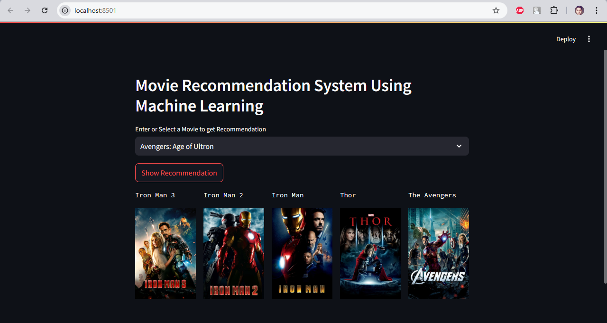

# Project : Movie Recommendation System Using Machine Learning!


This project involves developing a movie recommendation system that suggests movies to users based on their preferences and viewing history. By leveraging a cosine similarity matrix 📊, the system calculates the similarity between movie features, such as genre 🎭, cast 🎬, and user ratings ⭐, to provide personalized and accurate recommendations.
The model ensures a scalable and efficient solution 🔧 to enhance user experience 💡.

##  What is  Recommendation System ? 

- Recommendation System is nothing but the system which recommended on the basis of the Content-Based , Collaborative Filtering Based and  Hybrid Based Method .

## Types of Recommendation System :

### 1. Content Based : 

- A content-based recommendation system suggests items to users based on the features of items they have previously interacted with or liked. It matches the user's preferences with item attributes.

- Examples : In Netflix, if you watch a lot of science-fiction movies (e.g., Inception), it recommends other sci-fi movies (e.g., Interstellar) based on the genre, director, and storyline similarities.

### 2. Collaborative filtering Based : 

- Collaborative filtering is a recommendation technique that suggests items based on the preferences and behaviors of other users. It assumes that users with similar tastes will like similar items.

- Example : On Gaana or JioSaavn, if many users who listen to Artist A (Arijit Singh) also listen to Artist B (Shreya Ghoshal), the platform recommends Shreya Ghoshal to users who enjoy Arijit Singh, even if they've never searched for her music before. This works based on overlapping listening patterns of Indian audiences.

### 3. Hybrid Based : 

- Hybrid Recommendation System combines multiple recommendation approaches, such as content-based and collaborative filtering, to improve accuracy and overcome limitations of individual methods.

- Example : On Netflix, it uses collaborative filtering to identify popular shows among similar viewers and content-based filtering to match your preferences (e.g., genre, cast). If you watch Sacred Games, Netflix may recommend Delhi Crime (due to genre and cast similarities) and also shows liked by users with similar watching patterns.


# Demo :





# How to run ? 
### Steps : 

Clone the Repository

```bash
https://github.com/codecreator-dev004/Movies-Recommendation-System.git
```

### Step 01- Create a conda environment after opening the repository

```bash
conda create -n movie python=3.12.7 -y
```

```bash
conda activate movie
```

### Step 02- install the requirements
```bash
pip install -r requirements.txt
```

```bash
#run this file to generate the models

Movie Recommender System  Recommender_System.ipynb
```

Now run,
```bash
streamlit run app.py
```

```bash
Author: Devanshu Kumar
Python Developer
Email: kumardevasnhu553@gmail.com

```


