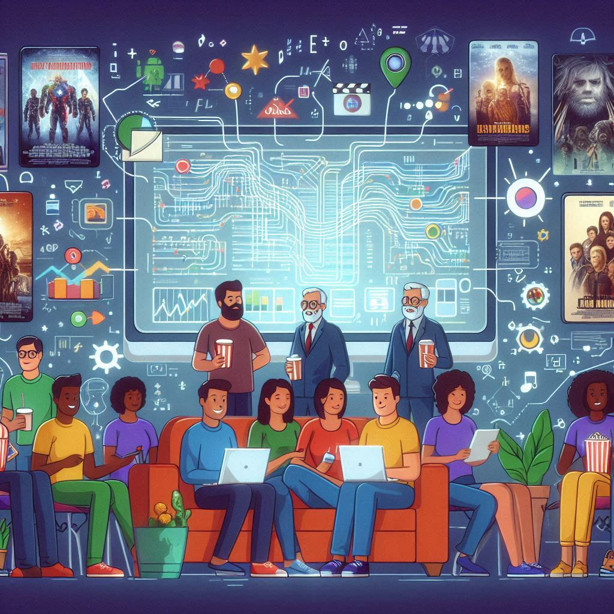

# Movie Recommendation System Using Machine Learning

This project involves developing a movie recommendation system that suggests movies to users based on their preferences and viewing history. By leveraging a cosine similarity matrix 📊, the system calculates the similarity between movie features, such as genre 🎭, cast 🎬, and user ratings ⭐, to provide personalized and accurate recommendations.
The model ensures a scalable and efficient solution 🔧 to enhance user experience 💡.

##  What is  Recommendation System ? 

Recommendation System is nothing but the system which recommended on the basis of the Content-Based , Collaborative Filtering Based and  Hybrid Based Method .

